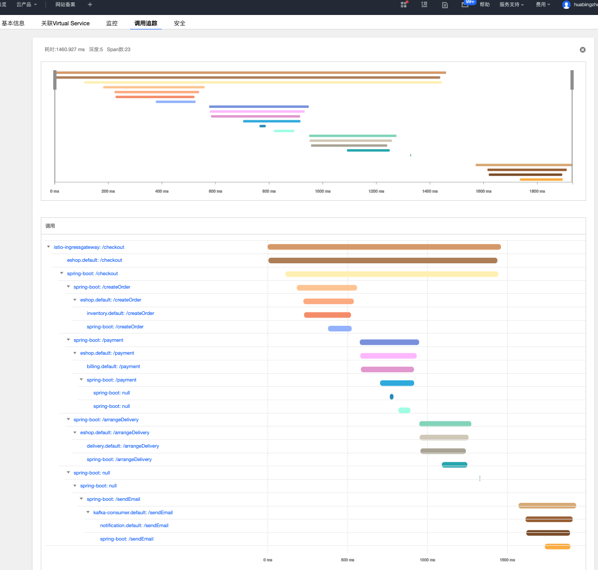

This demo show you how to leverage OpenTracing and Spring to propagate trace context across process boundaries, achieve method-level tracing and enable tracing for kafka messaging in an Istio service mesh.

# Use opentracing with Istio for tracing propagation and method-level tracing inside a service

### How to run this demo?
1. Create a mesh instance at [tencent clould mesh](https://console.cloud.tencent.com/tke2/mesh?rid=5).
1. Create a [TKE](https://console.cloud.tencent.com/tke2/cluster/startUp) cluster, and add this cluster into the mesh that you just created.
1. Download this repository: ```git clone https://github.com/aeraki-framework/method-level-tracing-with-istio.git```
1. deploy kafka into the TKE cluster: ```kubectl apply -f istio-opentracing-demo/k8s/kafka.yaml```
1. deploy eshop demo into the TKE cluster: ```kubectl apply -f istio-opentracing-demo/k8s/eshop.yaml```
1. Open this url in the browser to trigger the eshop service: http://${INGRESS_EXTERNAL_IP}/checkout
1. Open TCM UI in the browser to view the tracing.



### Understanding what happened under the hood
* The eshop demo uses opentracing and Zipkin for distributed tracing instrumentation. All the REST calls are automatically traced by opentracing.
* A 'Traced' AOP annotation is used for method-level tracing instrumentation.
* Zipkin opentracing implementation handles the trace context propagation crossing process boundaries. So we don't have to explicitly copy the tracing headers from downstream requests to upstream requests.
* A TracingKafka2RestTemplateInterceptor is used to propagate trace context from kafka headers to HTTP headers.

More at https://zhaohuabing.com/post/2019-06-22-using-opentracing-with-istio/

